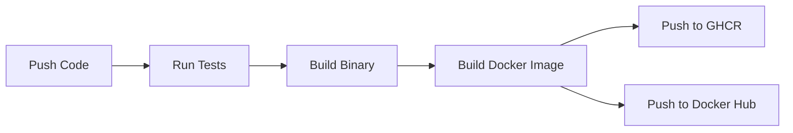

# 🚀 GitHub Actions & Docker Deployment Guide

## ✅ สิ่งที่ทำครบแล้วทั้งหมด

### 1. ✅ GitHub Actions Basics - Simple Workflow
**ไฟล์:** `.github/workflows/ci.yml` (hello-world job)

```yaml
hello-world:
  runs-on: ubuntu-latest
  steps:
    - name: Echo Hello World
      run: echo "Hello from GitHub Actions! 🚀"
```

**สิ่งที่เรียนรู้:**
- โครงสร้าง YAML workflow
- Jobs และ steps
- การใช้ GitHub expressions `${{ }}`
- Event triggers (push, pull_request)

---

### 2. ✅ Run Build/Test in CI
**ไฟล์:** `.github/workflows/ci.yml` (test-and-build job)

```yaml
- name: Run tests (go test ./...)
  run: go test ./... -v
```

**ผลลัพธ์:**
- ✅ CI รัน `go test ./...` อัตโนมัติทุกครั้งที่ push
- ✅ แสดงผล test แบบ verbose (`-v`)
- ✅ Job จะ fail ถ้า test ไม่ผ่าน

---

### 3. ✅ Dockerfile Multi-stage Build
**ไฟล์:** `Dockerfile`

```dockerfile
# Stage 1: Build
FROM golang:1.24-alpine AS builder
WORKDIR /src
COPY go.mod go.sum ./
RUN go mod download
COPY . .
RUN go build -v -o /app/server ./cmd

# Stage 2: Runtime
FROM alpine:3.18
COPY --from=builder /app/server /server
EXPOSE 3000
ENTRYPOINT ["/server"]
```

**ข้อดี:**
- ✅ Image ขนาดเล็ก (ใช้ alpine)
- ✅ แยก build dependencies ออกจาก runtime
- ✅ Secure (ไม่มี Go toolchain ใน production image)

**ทดสอบ Build:**
```powershell
docker build -t psd-booking:local .
docker run -p 3000:3000 -e PORT=:3000 psd-booking:local
```

---

### 4. ✅ Docker Compose (API + Postgres)
**ไฟล์:** `docker-compose.yml`

```yaml
services:
  postgres:
    image: postgres:16-alpine
    environment:
      POSTGRES_USER: bookinguser
      POSTGRES_PASSWORD: bookingpass
      POSTGRES_DB: bookingdb
    healthcheck:
      test: ["CMD-SHELL", "pg_isready -U bookinguser -d bookingdb"]
      
  api:
    build: .
    ports:
      - "3000:3000"
    depends_on:
      postgres:
        condition: service_healthy
```

**คุณสมบัติ:**
- ✅ Postgres database พร้อม healthcheck
- ✅ API รอให้ Postgres พร้อมก่อน (depends_on with condition)
- ✅ Networks และ volumes สำหรับ data persistence
- ✅ Environment variables configuration

**การใช้งาน:**
```powershell
# Start all services
docker compose up -d

# View logs
docker compose logs -f api

# Stop all services
docker compose down

# Stop and remove volumes
docker compose down -v
```

---

### 5. ✅ CI + Docker Integration (Complete Pipeline)
**ไฟล์:** `.github/workflows/ci.yml`

**Pipeline Flow: Commit → Test → Build → Push**



**Features:**
1. **Automated Testing** - `go test ./...`
2. **Binary Build** - `go build -o server ./cmd`
3. **Docker Build** - Multi-stage Dockerfile
4. **Push to GHCR** - GitHub Container Registry (automatic)
5. **Push to Docker Hub** - Requires secrets configuration

**Docker Registries:**
- ✅ **GHCR:** `ghcr.io/eursukkul/psd-fiber-booking-system:latest`
- ✅ **Docker Hub:** `<username>/psd-fiber-booking-system:latest`

---

## 🔧 Setup Instructions

### A. Docker Hub Secrets (Required)

1. ไปที่ GitHub Repository → Settings → Secrets → Actions
2. เพิ่ม secrets สองตัว:

```
DOCKERHUB_USERNAME = your-dockerhub-username
DOCKERHUB_TOKEN = your-dockerhub-access-token
```

**สร้าง Access Token:**
1. ไปที่ [Docker Hub](https://hub.docker.com/)
2. Settings → Security → New Access Token
3. Copy token และเก็บไว้

### B. Local Development

```powershell
# 1. Clone repository
git clone https://github.com/Eursukkul/psd-fiber-booking-system.git
cd psd-fiber-booking-system

# 2. Start with Docker Compose
docker compose up -d

# 3. Check API
curl http://localhost:3000/api/bookings

# 4. View logs
docker compose logs -f api

# 5. Stop services
docker compose down
```

### C. Testing the CI Pipeline

```powershell
# 1. Make a change
echo "# Test" >> README.md

# 2. Commit and push
git add .
git commit -m "test: trigger CI pipeline"
git push origin main

# 3. Watch Actions
# Go to: https://github.com/Eursukkul/psd-fiber-booking-system/actions
```

---

## 📊 CI/CD Workflow Details

### Job 1: hello-world
- ⏱️ Duration: ~10 seconds
- 🎯 Purpose: Basic workflow validation
- ✅ Always runs

### Job 2: test-and-build
- ⏱️ Duration: ~2-3 minutes
- 🎯 Purpose: Test → Build → Deploy
- 📦 Outputs: Binary + Docker images
- ⚙️ Needs: hello-world job to complete

---

## 🏷️ Docker Image Tags

```yaml
tags: |
  type=ref,event=branch          # main, dev, feature-x
  type=ref,event=pr              # pr-123
  type=semver,pattern={{version}}  # 1.2.3
  type=raw,value=latest          # latest (on main branch only)
  type=sha,prefix={{branch}}-    # main-abc1234
```

**ตัวอย่าง Tags:**
- `latest` - Latest from main branch
- `main` - Main branch
- `pr-45` - Pull request #45
- `main-abc1234` - Commit SHA

---

## 🔍 Troubleshooting

### ❌ Tests Failing
```powershell
# Run locally to debug
go test ./... -v
```

### ❌ Docker Build Failing
```powershell
# Build locally with verbose output
docker build --no-cache --progress=plain -t test .
```

### ❌ Docker Hub Push Failing
- ตรวจสอบว่าได้เพิ่ม `DOCKERHUB_USERNAME` และ `DOCKERHUB_TOKEN` ใน GitHub Secrets
- Verify token hasn't expired

### ❌ Postgres Connection Issues
```powershell
# Check postgres logs
docker compose logs postgres

# Test connection
docker compose exec postgres psql -U bookinguser -d bookingdb
```

---

## 📚 Next Steps

### 1. Add Swagger Documentation
```bash
swag init
```

### 2. Add Health Check Endpoint
```go
app.Get("/health", func(c *fiber.Ctx) error {
    return c.JSON(fiber.Map{"status": "ok"})
})
```

### 3. Production Environment Variables
สร้าง `.env.production`:
```env
PORT=:8080
JWT_SECRET=<strong-secret>
DB_HOST=production-db.example.com
```

### 4. Kubernetes Deployment (Optional)
```yaml
apiVersion: apps/v1
kind: Deployment
metadata:
  name: booking-api
spec:
  replicas: 3
  template:
    spec:
      containers:
      - name: api
        image: ghcr.io/eursukkul/psd-fiber-booking-system:latest
```

---

## 🎉 สรุป

✅ **ทำครบทั้งหมด 5 ข้อ:**

1. ✅ GitHub Actions Basics (echo workflow)
2. ✅ Run Build/Test in CI (`go test ./...`)
3. ✅ Dockerfile Multi-stage Build
4. ✅ Docker Compose (API + Postgres)
5. ✅ CI + Docker Integration (Push to GHCR + Docker Hub)

**Pipeline ครบวงจร:**
```
Code → Commit → Test → Build → Docker Build → Push to Registry → Deploy
```

---

## 📞 Support

- **GitHub:** https://github.com/Eursukkul/psd-fiber-booking-system
- **Issues:** https://github.com/Eursukkul/psd-fiber-booking-system/issues
- **Actions:** https://github.com/Eursukkul/psd-fiber-booking-system/actions
